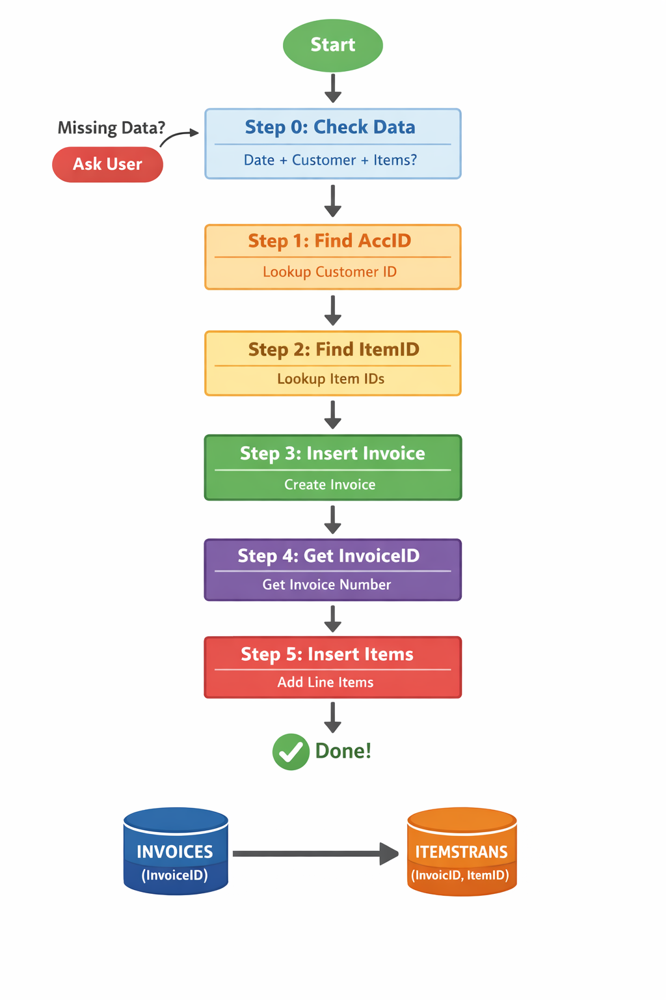
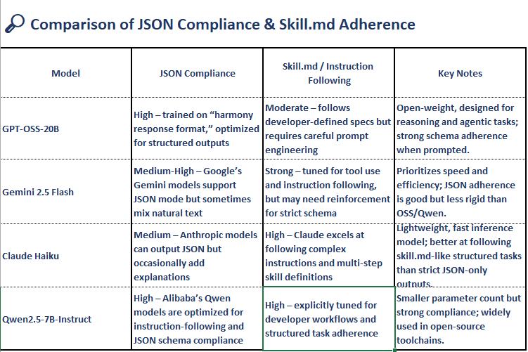

## Demo Video

[](https://youtu.be/EWxoyoI3oHY)
# Telegram MCP MS Access Agent

Control a **Microsoft Access database** directly from **Telegram** using an **AI Agent** powered by the **Model Context Protocol (MCP)**.

This project demonstrates how natural language messages sent to a Telegram bot can trigger database operations such as inserting records and querying data from a local Microsoft Access database.

The system connects Telegram, an AI model, and a local database through MCP to enable remote database interaction.

---
## v0.03

replace db_context.py with skill.md file
In the same way a README.md tells a human what a project does, a skill.md acts as a "behavior manual" for the AI. Its main goal is consistency and specialized performance.

sample promt insert new invoice dated 1-3-2026 for ayman customers  total amount 200 items  rice 10*10 sugar 10*10 ?

result data inserted to both  invoices and itemstrans tables



skill.md function

Comparison between AI models for JSON compliance and Skill.md file adherence


# Project Repository

GitHub:
https://github.com/ayamnash/telegram-mcp-ms_access-agent

---

# Overview

This project shows how an AI agent can interact with a local database through MCP while using Telegram as a remote user interface.

Instead of manually accessing the database, users simply send commands to a Telegram bot.  
The AI agent interprets the request and executes the required operation on the database.

Currently supported operations:

- Insert records into Microsoft Access
- Query data from the database

---

# Architecture

The system follows a simple architecture:

```

Telegram User
↓
Telegram Bot
↓
AI Agent
↓
MCP Client
↓
MCP Server
↓
Microsoft Access Database

```

MCP acts as the communication layer that allows AI agents to interact with external tools and services in a standardized way. :contentReference[oaicite:1]{index=1}

---

# Example Usage

Insert a record:

```

Add new employee
Name: John
Salary: 500

```

Query data:

```

Show all employees

```

The bot processes the request and sends the database results back to Telegram.

---

# Requirements

Ensure the architecture is consistent between Python and Microsoft Office.

Use either:

### 32-bit Environment

```

Python 32-bit
Microsoft Office 32-bit
Access Database Engine 32-bit

```

or

### 64-bit Environment

```

Python 64-bit
Microsoft Office 64-bit
Access Database Engine 64-bit

```

Mixing architectures may cause database driver errors.

---

# Installation

Clone the repository

```

git clone https://github.com/ayamnash/telegram-mcp-ms_access-agent.git
cd telegram-mcp-ms_access-agent

```

Install dependencies

```

pip install -r requirements.txt

```

---

# Configuration

Create or edit `config.py` and add your credentials:

```

BOT_TOKEN = "YOUR_TELEGRAM_BOT_TOKEN"
GEMINI_API_KEY = "YOUR_GEMINI_API_KEY"
HUGGINGFACE_API_KEY= "YOUR_HUGGINGFACE_KEY"

```

---

# Run the Bot

Start the application

```

python main.py

```

If everything is configured correctly you should see:

```

BOT RUNNING

```

Now you can control your Microsoft Access database directly from Telegram.

---

# Dependencies

The project uses the following Python libraries:

- fastmcp
- python-telegram-bot
- pyodbc
- pywin32
- google-generativeai
- openai

---

# Use Cases

- Remote database management
- AI-assisted database queries
- Telegram-based automation
- AI agent experimentation with MCP

---

# License

This project is open-source and provided for educational and experimental purposes.
```


