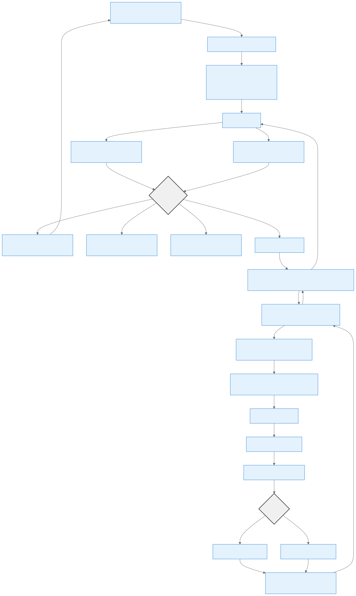

## 📂 File Overview

| File                   | Description |
|------------------------|-------------|
| **telegram_bot.py**    | Receives Telegram messages, manages user sessions and conversation state, sends user requests to the AI model, processes AI actions (`ask`, `execute_operation`, `done`, `cancel`), communicates with the MCP client, and returns final responses to the user. It does not contain business logic or SQL execution. |
| **mcp_client.py**      | Acts as the communication bridge between the Telegram bot and the MCP server. It sends tool names and arguments to the MCP server and returns the raw tool results back to the bot. It contains no business rules. |
| **server.py**          | Serves as the MCP entry point and tool gateway. It exposes MCP tools such as `execute_operation`, receives tool calls from the client, and forwards the operation request to the internal operation registry. It acts as an abstraction layer between the bot/client side and the business-operation layer. |
| **operations/__init__.py** | Initializes the operations layer at startup. It loads domain modules and registers all available business operations into the central registry. If you have accounting management and hospital management, this file records both in the registry. |
| **operations/registry.py** | Maintains the mapping between operation names (such as `accounting.create_invoice`) and their corresponding Python handler functions. It separates operation naming from implementation and provides controlled dispatching. |
| **operations/shared.py**   | Provides shared infrastructure helpers used across domains, such as database connection handling, validation utilities, error classes, data normalization, and row-to-JSON formatting. It contains reusable technical logic, not domain-specific business rules. Its benefit is preventing the duplication of the same code in each domain. |
| **operations/accounting.py** | Implements the accounting domain business logic. It contains the real operation handlers such as creating invoices, listing items, creating customers, and querying invoice data. It also performs operation-specific validation and controls transaction boundaries for write operations. |


```markdown
# System Architecture Workflow

The bot handles conversation, the MCP client handles transport, the server exposes tools, the registry resolves operation names, and the domain file executes the real business logic against the database.

---

"If only the ""system type"" changes from accounting to hospital, you most likely won't need to make any major changes to [server.py]. Instead, you'll need to:
- Add a new file like `operations/hospital.py`
- Register it in `operations/__init__.py`
- Update [SKILL.md] and the Prompt bot"

---

## **When does `server.py` actually change?**

It changes if you want to develop the system's ""general rules,"" not the accounting logic or the hospital itself. For example:

`permission checking` - This means that before executing any operation, we verify whether the user is actually authorized.
- For example: A receptionist can `create_patient` but cannot delete an invoice.
- This is general logic, so its appropriate place is usually in `server.py` or a shared layer before it.

`audit logging` - This means logging every operation that takes place:
- Who is the user?
- What is the operation?
- When?
- Was it successful or failed?
- This is also general behavior for all operations, not specific to a single invoice or patient.

`domain config loading` - This means choosing domain settings according to the `domain`. Example:
`accounting` uses the `invoice.accdb` rule.
`hospital` uses the `hospital.accdb` rule.
If you want the system to load the settings for each domain centrally, you might add global logic to `server.py` or a shared config layer.

`routing policy` - This refers to the rules for routing requests:
- Is this process allowed for this domain?
- Does the process name follow the correct syntax?
- Are we only allowing a list of registered processes?
- This is also global structure logic.

`response format` - This refers to the format of the standardized response.
Example:

```json
{
""status"": ""success"",
""domain"": ""accounting"",
""operation"": ""accounting.create_invoice"",
""message"": ""..."",
""data"": {...}
}
```

- If you want to have a consistent look across all systems, you might need to modify `server.py` or the registry.

## **Practical Summary**
- Changing the database only: We usually modify the operations file for that domain and its settings, not `server.py`.
- Changing the overall system architecture: Here, we might modify `server.py`.
- Currently, `server.py` is the general gateway, and `operations/accounting.py` is the actual accounting logic.
```
